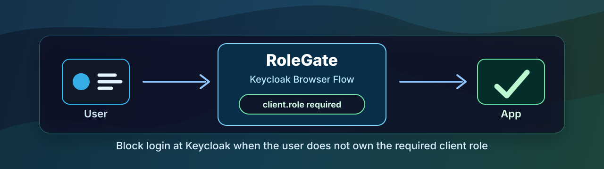

# RoleGate - Keycloak Client Role Gate

[](https://github.com/thomas-illiet/rolegate/actions/workflows/e2e.yml)



RoleGate configures Keycloak so a user is blocked from logging in to a target
OIDC client unless they own a required client role.

The access decision happens inside the Keycloak Browser Flow, before the user
is redirected to the application.

## Quick Start

```bash
export REALM=my-realm
export TARGET_CLIENT_ID=my-product
export REQUIRED_ROLE=app-access
export KEYCLOAK_ADMIN=admin
export KEYCLOAK_ADMIN_PASSWORD=admin

./scripts/keycloak-create-client-role-flow.sh
```

The script creates a dedicated Browser Flow and prints the `kcadm.sh` command
needed to bind that flow to the target client.

## Documentation

- [Overview](./docs/overview.md): what RoleGate does and where it fits.
- [Script usage](./docs/script-usage.md): required inputs, variables, and examples.
- [Client activation](./docs/client-activation.md): how to bind the generated flow to one OIDC client.
- [Local validation](./docs/local-validation.md): optional Docker Compose validation environment.
- [Continuous integration](./docs/ci.md): GitHub Actions E2E validation for `main` and pull requests.
- [Dependabot updates](./docs/dependabot.md): automated Keycloak upgrade pull requests.
- [Caveats](./docs/caveats.md): important security and Keycloak flow notes.

## Main Script

```bash
./scripts/keycloak-create-client-role-flow.sh
```

The validation code lives under [`validation/`](./validation/). It is not
required to use RoleGate against your own Keycloak instance.
