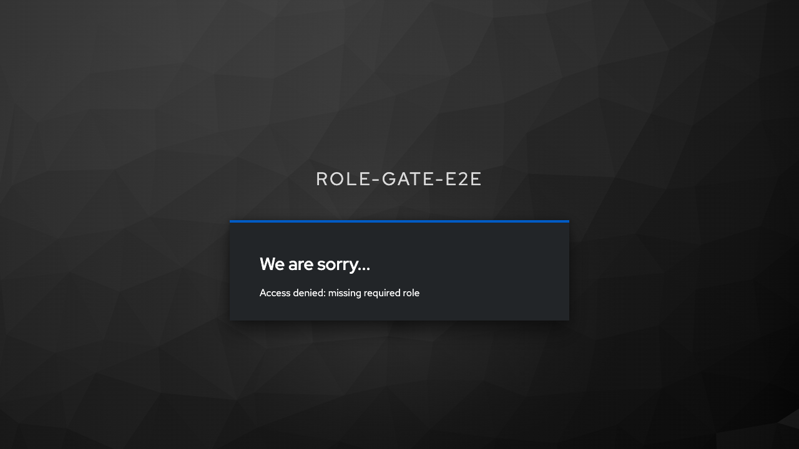

# Client Activation

RoleGate creates the Browser Flow but does not activate it automatically in the
main script.

Activation is done with a client-level Browser Flow override. The simplest
option is to let the Python script apply it:

```bash
./scripts/rolegate-setup.sh --activate
```

The script prints the target client UUID and flow ID after creating the flow.
If you want to apply the same update manually through Admin REST, send a `PUT`
request to:

```text
/admin/realms/<realm>/clients/<client-uuid>
```

with the existing client representation updated to include:

```json
{
  "authenticationFlowBindingOverrides": {
    "browser": "<flow-id>"
  }
}
```

## Why Client-Level Activation

Binding the flow at client level protects only the target OIDC client. This
avoids changing the Browser Flow for every client in the realm.

That matters when the realm also contains:

- administration clients;
- internal service clients;
- other products with different access rules;
- clients that should keep the default Browser Flow.

## Expected Result

After activation:

- users with the required client role complete login and reach the client;
- users without the required client role are stopped by Keycloak;
- Keycloak shows the configured deny message;
- the application does not receive an authorization callback for blocked users.

Example denied screen:


