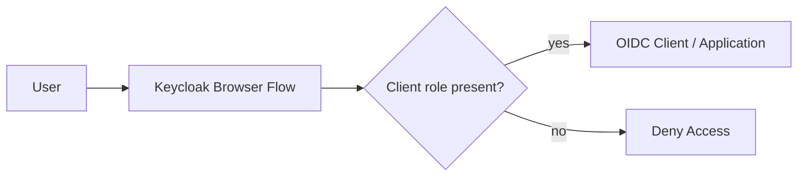

# Overview

RoleGate creates a Keycloak Browser Flow that blocks access to an OIDC client
when the authenticated user does not have a required client role.



For example, if the target client is `my-product` and the required role is
`app-access`, the user must own the client role:

```text
my-product.app-access
```

If the role is missing, Keycloak displays an access-denied screen and does not
redirect the user to the application.

## Why Configure This In Keycloak

RoleGate is useful when access to the application itself should be decided
before the application receives the user. It keeps the entry gate in Keycloak
instead of adding minimal "can this user open the product?" logic inside the
product.

This is not a replacement for fine-grained business authorization. The
application must still validate OIDC tokens and enforce any domain-level
permissions it owns.

## What The Script Creates

The main script uses native Keycloak authenticators:

- `conditional-user-role`
- `deny-access-authenticator`

It:

- validates that the realm, target client, and required client role exist;
- copies the base Browser Flow, by default `browser`;
- finds the copied `forms` sub-flow;
- adds a conditional sub-flow;
- configures `conditional-user-role` with `condUserRole=<clientId>.<role>`;
- sets `negate=true`, so the sub-flow runs when the role is missing;
- adds `deny-access-authenticator`;
- prints the command needed to activate the flow on the target client.

The script does not change the realm-wide Browser Flow.
